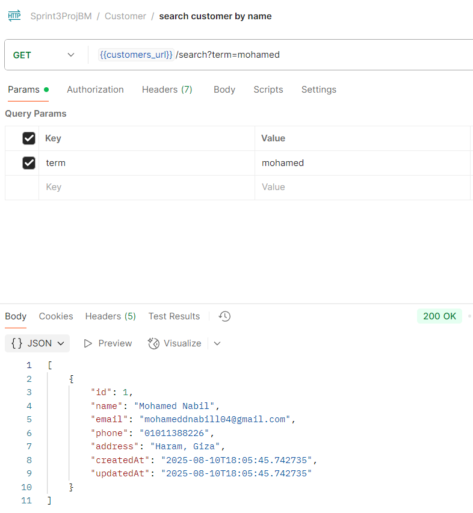

## Bank Account System
This is a project for a bank account system with Spring Boot that supports account creation, deposits, withdrawals, transaction tracking, and customer management. The project covers back-end architecture including JPA, repositories, entity relationships, DTOs, REST APIs, validation, exception handling, and REST best practices.

## Features
- **Customer Management**: Create, update, and manage customer profiles
- **Account Operations**: Support for multiple account types (Savings, Checking, Business, Student)
- **Transaction Tracking**: Complete audit trail of all financial transactions
- **Money Transfers**: Secure transfers between customer accounts
- **Balance Inquiries**: Real-time balance checking and account history
- **Data Validation**: Comprehensive input validation and error handling
- **Audit Trail**: Automatic timestamp tracking for all operations


## Technology Stack

- **Backend**: Spring Boot 3.x
- **Database**: MySQL 8.0
- **ORM**: Spring Data JPA / Hibernate
- **Validation**: Bean Validation (Jakarta)
- **API**: RESTful Web Services
- **Build Tool**: Maven
- **Java Version**: 17+

## Prerequisites

- Java 17 or higher
- Maven 3.6+
- MySQL 8.0
- Git

## Project Structure

```
src/main/java/com/bankapp/
├── entities/
│   ├── Customer.java
│   ├── BankAccount.java
│   ├── Transaction.java
│   └── TransactionType.java (enum)
│
├── repositories/
│   ├── CustomerRepository.java
│   ├── BankAccountRepository.java
│   └── TransactionRepository.java
│
├── services/
│   ├── CustomerService.java
│   ├── BankAccountService.java
│   └── TransactionService.java
│
├── mappers/
│   ├── CustomerMapper.java
│   ├── BankAccountMapper.java
│   └── TransactionMapper.java
│
├── controllers/
│   ├── CustomerController.java
│   ├── BankAccountController.java
│   └── TransactionController.java
│
├── dtos/
│   ├── CustomerDTO.java
│   ├── BankAccountDTO.java
│   └── TransactionDTO.java
│   
├── exception/
│   ├── GlobalExceptionHandler.java
│   └── ResourceNotFoundException.java
│
└── BankaccountssytemApplication.java
```

### Customer Endpoints
- **POST `/api/customers`**: Create a new customer 
- **GET `/api/customers`**: Get all customers 
- **GET `/api/customers/{id}`**: Get a customer by ID 
- **PUT `/api/customers/{id}`**: Update a customer by ID 
- **DELETE `/api/customers/{id}`**: Delete a customer by ID 
- **GET `/api/customers/email/{email}`**: Get a customer by email 
- **GET `/api/customers/search?term="name"`**: Search customers by name 
- **GET `/api/customers/count`**: Get customers count 
- **GET `/api/customers/created-between?startDate="startDate"&endDate="endDate"`**: Get customers created in a time range 

### BankAccount Endpoints
- **POST `/api/accounts`**: Create a new account 
- **GET `/api/accounts`**: Get all accounts 
- **GET `/api/accounts/{id}`**: Get an account by ID 
- **POST `/api/accounts/deposit?accountId="toAccountId"&amount="amount"`**: deposit to an account by ID 
- **POST `/api/accounts/withdraw?accountId="fromAccountId"&amount="amount"`**: withdraw from an account by ID 
- **POST `/api/accounts/transfer?fromAccountId="fromAccountId"&toAccountId="toAccountId"&amount="amount"`**: transfer from an account to another account 
- **GET `/api/accounts/type/{accountType}`**: Get accounts by accountType (Savings, etc.) 
- **GET `/api/accounts/{min}/{max}`**: Get accounts with balance in a specific range 

### Transaction Endpoints
- **GET `/api/v1/accounts/{accountId}/transactions`**: Get transactions for a specific account 
- **GET `/api/v1/transactions/{id}`**: Get a transaction by ID 

## Validation Rules
- `name`: must be between 2 and 100 characters
- `email`: Must be valid and unique
- `phone`: Must be between 10 and 15 characters
- `address`: Max 255 characters
- `transactionType`: enum with values ['DEPOSIT', 'WITHDRAWAL', 'TRANSFER']
- `accountNumber`: 32 characters

Invalid input results in HTTP 400 with descriptive error messages.

## Exception Handling
- **Validation errors** return `400 BAD REQUEST` with detailed error messages.
- **Resource not found** returns `404 NOT FOUND`.
- **Duplicate customer email** returns `409 CONFLICT`.
- All exceptions are handled by a global `@ControllerAdvice`.
- Screenshots of handled exceptions are attached in docs/images/exceptionHandling folder
